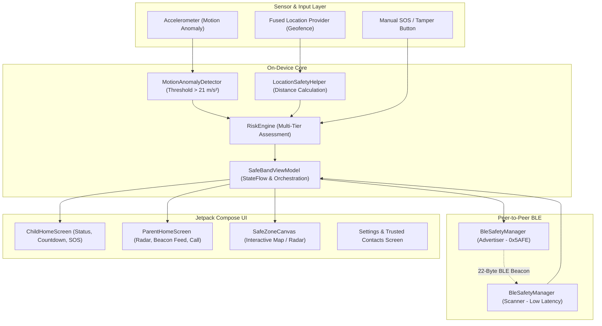

# SafeBand (ChildGuard) 🛡️

[](https://developer.android.com/)
[](https://kotlinlang.org/)
[](https://developer.android.com/jetpack/compose)
[](#system-architecture)
[](LICENSE)

**SafeBand (ChildGuard)** is a peer-to-peer child-safety early-warning prototype built natively for Android. It combines **Bluetooth Low Energy (BLE) direct peer beaconing**, **real-time motion anomaly detection**, **customizable geofencing**, and a **multi-tier on-device risk assessment engine** to deliver immediate emergency alerts between child and parent devices—**completely offline without requiring cellular internet or centralized cloud servers**.

---

## 📱 Download & Install APK

Directly install the latest pre-compiled Android APK on any Android 7.0+ (API 24+) smartphone:

👉 **[Download SafeBand v1.0.2 Debug APK (Direct .apk)](https://github.com/Unknsn/childgaurd/releases/download/v1.0.2/app-debug.apk)**

> Or visit the **[v1.0.2 GitHub Release Page](https://github.com/Unknsn/childgaurd/releases/tag/v1.0.2)** to view release notes and checksums.

---

## 📌 Key Highlights

- **🩺 Child Bio Data & Medical Profile Container**: During any emergency alert (SOS beacon or boundary departure), an interactive bio data card displays the child's identity, blood group badge (e.g. `🩸 O+`), primary and secondary parents' phone numbers, medical conditions, known allergies, and instructions, with a 1-tap direct call button.
- **💬 Medical & Bio Data in SOS SMS Dispatches**: Emergency dispatch messages automatically compile the child's complete medical profile alongside real-time GPS coordinates.
- **📡 Zero-Cloud Peer-to-Peer Protocol**: Operates purely over Bluetooth Low Energy (BLE) advertisements and local GPS/accelerometer sensors without internet or cloud backends.
- **🧠 Multi-Tier On-Device Risk Engine**: Dynamically calculates risk levels (`NORMAL`, `LOW`, `WARNING/MEDIUM`, `EMERGENCY/HIGH`) from sensor anomalies to minimize false alarms.
- **⏱️ False-Alarm Mitigation**: Features a 10-second countdown cancellation window before broadcasting medium/high risk warnings (with instant bypass for manual SOS).
- **📍 Real-Time Safe Zone Geofencing**: Computes boundary distances with dynamic circular safe zones and an interactive Compose visual canvas.
- **🚨 Multi-Modal Alerting & Verified Silence Retention**: Escalates alerts with graduated haptic vibration waveforms and audible tones, with reliable silence retention and automatic watchdog timeout.
- **🔒 Privacy-Preserving by Design**: All safety event logs, bio data, and contact data are persisted locally using **Room Database** and encrypted DataStore; no user tracking or telemetry.

---

## 🏗️ System Architecture



---

## ⚙️ Multi-Tier Risk Evaluation Engine

The `RiskEngine` evaluates concurrent sensor flags to prevent panic while ensuring critical alerts are broadcasted immediately:

| Risk Level | Trigger Condition | System Action | Broadcast Behavior |
| :--- | :--- | :--- | :--- |
| **NORMAL** (`#10B981`) | No anomalies active | Nominal monitoring | Standby / No broadcast |
| **LOW** (`#3B82F6`) | Exactly 1 anomaly (e.g. motion spike *or* safe zone exit) | Logged locally to Room audit log | **No BLE broadcast** (preserves battery & privacy) |
| **MEDIUM (Warning)** (`#F59E0B`) | Exactly 2 concurrent anomalies (e.g. safe zone exit *and* motion spike) | Initiates 10-second confirmation countdown; escalates if uncancelled | **BLE broadcast enabled** upon confirmation |
| **HIGH (Emergency)** (`#EF4444`) | Manual SOS button triggered **or** $\ge 3$ concurrent anomalies | Immediate acoustic alarm, full haptic pulse, emergency contact action | **Instant BLE broadcast** (countdown bypassed) |

---

## 📡 BLE Protocol Specification

When transmitting an emergency beacon, SafeBand broadcasts custom manufacturer data under identifier `0x5AFE`:

```
+--------+--------+------------------+-----------+--------------------+-------------------+-------------------+
| Byte 0 | Byte 1 |    Bytes 2-8     |  Byte 9   |    Bytes 10-13     |    Bytes 14-17    |    Bytes 18-21    |
|  0x53  |  0x42  |    Device ID     | Risk Byte |   Timestamp (s)    |   Latitude (f)    |   Longitude (f)   |
|  ('S') |  ('B') | ASCII (7 chars)  | (0,1,2,3) | 32-bit Int (epoch) | IEEE 754 Float32  | IEEE 754 Float32  |
+--------+--------+------------------+-----------+--------------------+-------------------+-------------------+
```

- **Manufacturer ID**: `0x5AFE`
- **Service UUID**: `00005afe-0000-1000-8000-00805f9b34fb`
- **Total Payload Size**: 22 bytes (well within the legacy 24-byte BLE advertisement limit)

---

## 📱 Application Modes & Screens

### 1. Child Mode
- **Status Dashboard**: Live risk level banner, active anomaly tags, and real-time safe zone distance meter.
- **Interactive Safe Zone Canvas**: Visual representation of the child's position relative to the configured geofence radius.
- **Manual SOS / Tamper Button**: One-tap instant emergency trigger.
- **Countdown Alert Card**: 10-second cancellation timer for non-SOS alerts with an immediate dismiss option.
- **Simulation Controls**: Built-in debug controls to simulate motion anomalies and geofence departures for demonstration.

### 2. Parent / Guardian Mode
- **Radar & Beacon Listener**: Continuously listens for child device BLE advertisements.
- **Emergency Alert Bottom Sheet**: Pops up immediately upon receiving a MEDIUM or HIGH risk beacon with timestamps and coordinates.
- **Emergency Call Trigger**: Direct dial intent to designated trusted contacts.
- **Alert Timer**: Tracks the active duration of the ongoing incident.

### 3. Settings & History
- **Safe Zone Configurator**: Customize center latitude, longitude, and safety radius (in meters).
- **Trusted Contacts Manager**: Add and manage emergency contact names, phone numbers, and guardian relationships.
- **Alert History Screen**: Chronological audit trail of all safety events, cancellations, and escalations stored in local SQLite via Room.

---

## 📁 Project Structure

```
d:/sip/
├── app/
│   ├── src/
│   │   ├── main/
│   │   │   ├── AndroidManifest.xml          # Permissions & activity declarations
│   │   │   ├── java/com/example/
│   │   │   │   ├── MainActivity.kt          # Main Compose entry & permission flows
│   │   │   │   ├── data/
│   │   │   │   │   ├── local/               # Room Database, SafetyEvent & TrustedContact DAOs
│   │   │   │   │   ├── preferences/         # Jetpack DataStore preferences
│   │   │   │   │   └── repository/          # SafetyRepository abstraction
│   │   │   │   ├── engine/
│   │   │   │   │   └── RiskEngine.kt        # Pure risk scoring & evaluation rules
│   │   │   │   ├── model/
│   │   │   │   │   └── SafetyModels.kt      # RiskLevel, AlertFlag, SafeZone, BlePayload
│   │   │   │   ├── service/
│   │   │   │   │   ├── AlertNotifier.kt     # Haptic vibration & tone generator
│   │   │   │   │   ├── BleSafetyManager.kt  # BLE Advertiser & Scanner
│   │   │   │   │   ├── LocationSafetyHelper.kt # GPS & geofence distance logic
│   │   │   │   │   └── MotionAnomalyDetector.kt # Accelerometer spike detection
│   │   │   │   └── ui/
│   │   │   │       ├── SafeBandViewModel.kt # Central state holder & event pipeline
│   │   │   │       ├── components/          # Reusable Compose widgets (Canvas, Cards, Sheets)
│   │   │   │       ├── screens/             # ModeSelection, ChildHome, ParentHome, Settings
│   │   │   │       └── theme/               # Material 3 Color, Type, and Theme definitions
│   │   │   └── res/                         # App icons, strings, and XML configs
│   │   └── test/                            # Unit tests, Robolectric & Roborazzi screenshot tests
│   └── build.gradle.kts                     # App module dependencies & configuration
├── gradle/                                  # Version catalog (libs.versions.toml) & wrapper
├── metadata.json                            # Prototype descriptor
└── README.md
```

---

## 🛠️ Getting Started

### Prerequisites
- **Android Studio** Ladybug (2024.2.1) or newer
- **Android SDK**: `minSdk = 24` (Android 7.0), `targetSdk = 36`
- **Physical Device Recommended**: Testing Bluetooth Low Energy advertising and hardware accelerometer triggers works best on physical Android devices. A single-device simulation mode is also included in the UI.

### Building & Running
1. Clone the repository:
   ```bash
   git clone https://github.com/Unknsn/childgaurd.git
   cd childgaurd
   ```
2. Open the project in **Android Studio**.
3. Allow Gradle to sync dependencies.
4. Run on your connected device or emulator:
   ```bash
   ./gradlew installDebug
   ```

### Running Tests
Execute the local unit test suite (including `RiskEngineTest` and payload serialization tests):
```bash
./gradlew testDebugUnitTest
```

---

## 🔒 Permissions & Privacy

SafeBand requires the following Android permissions strictly for local on-device operation:
- `ACCESS_FINE_LOCATION` & `ACCESS_COARSE_LOCATION`: Required for computing distance from the user-defined safe zone and BLE discovery.
- `BLUETOOTH_SCAN` & `BLUETOOTH_ADVERTISE` (`API 31+`): Required for direct peer-to-peer child-to-parent beacon transmission without an internet connection.
- `VIBRATE` & `POST_NOTIFICATIONS`: Required for high-priority local emergency alerts.

> **Data Sovereignty Guarantee**: No audio, biometric, or location coordinates are uploaded to any external server. All logs and preferences are stored exclusively on the device's private SQLite sandbox.

---

## 📋 Out of Scope / Future Roadmap

This software prototype demonstrates early-warning detection and local peer communication. The following capabilities are reserved for future hardware/cloud integration phases:
- Dedicated external wearable hardware with physical anti-tamper wrist switches
- Long-range relay via fixed LoRa/cellular community hubs
- Cloud-based municipal 911/emergency authority escalation
- Multi-hop mesh relay beyond direct peer BLE range

---

## 📄 License

This project is licensed under the Apache License, Version 2.0. See the [LICENSE](LICENSE) file for details.
